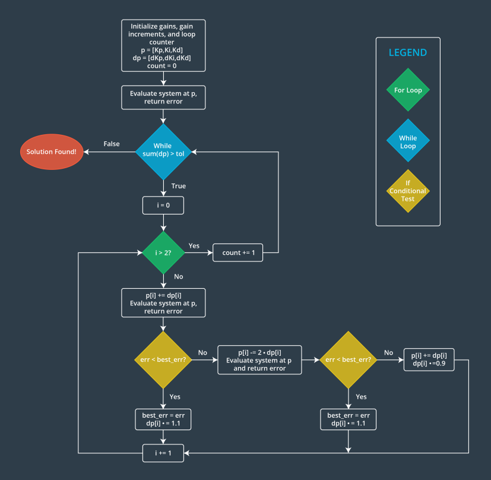
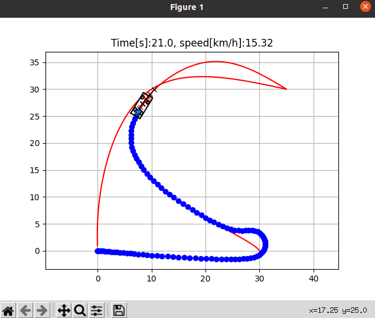
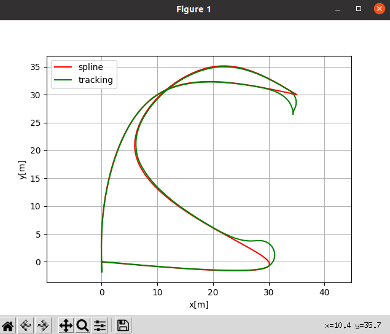
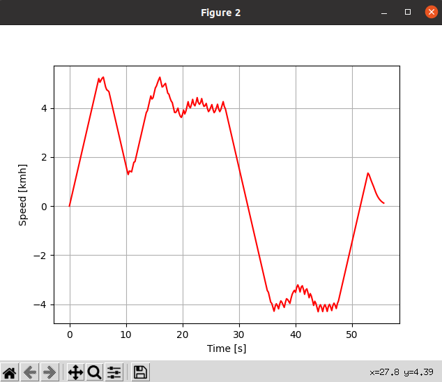

# control_tutorial_code

## 0 Content

- Open Loop Control
- Closed Loop Control
- Control use case
- Twiddle optimization for best parameters
- How to use code

## 1 Open Loop Control

Open-loop control, also known as an open-loop control system, is a control system where the output is not fed back to influence the input. In an open-loop control system, the input can affect the output, but the input is not influenced by the output. The signal from the input to the output is unidirectional.

## 2 Closed Loop Control

Closed-loop control, also known as a closed-loop control system, refers to a control system where the output can influence the input through a **feedback loop**, thereby affecting the control process of the system.

## 3 Control use case

- Lane correction
- Speed control
- UAV altitude control
- ...

## 4 Twiddle optimization for best parameters

To avoid the manual guesswork and trial-and-error process for obtaining better PID values, we can design an automated tuning logic loop. By aiming to minimize a specified objective function, we can obtain a more optimal parameter set.

A more intelligent and automated approach is to use the gradient descent algorithm. 

- The prerequisite is to start with an initial guess vector of three gains. Typically, a small nonzero value is used for P, while I and D are set to 0. 
- Then, each gain is incrementally adjusted, and the objective function is tested for a decrease. If it decreases, the parameters are continuously modified in the same direction. Otherwise, an attempt is made to adjust the parameters in the opposite direction. 
- If neither increasing nor decreasing the gain values reduces the cost function, the magnitude of the gain increment is reduced, and the process is repeated. 
- The entire loop should continue until the magnitude of the increment decreases below a certain threshold.



## 5 How to use code

### 5.1 Set up environment

```
conda create -n control python=3.7
pip install -r requirements.txt 
```

### 5.2 Understand PID tunning

For different models, PID controller needs to be fine-tune accordingly. 

Change the `robot.py`, locate the following lines of code, and change the length to `20`.

From:

```python
class Robot(object):

    def __init__(self, length=4.5):
```

To:

```
class Robot(object):

    def __init__(self, length=20):
```

## 5.3 For code detail usage

Please check the following [README](https://github.com/zhz03/control_tutorial_code/blob/main/control_code/PID_scripts/README.md)

## 6 MCP control

The MPC controller minimize this cost function defined as:
$$
J = x^TQx + u^TRu
$$
subject to:

- Linearized Inverted Pendulum model
- Initial state

For more detailed code implementation, please check this [README](https://github.com/zhz03/control_tutorial_code/blob/main/control_code/MPC_scripts/README.md)

Here is the results:







## Reference

[1] [Controls in Robotics - Robotics Nanodegree by Udacity (Term1)](https://jmlb.github.io/robotics/2018/04/22/controls_in_robotics/)
