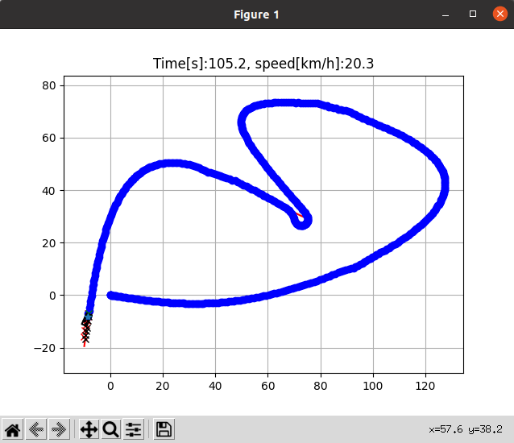

# Model predictive speed and steering control



This is a path tracking simulation using model predictive control (MPC). 

The MPC controller controls vehicle speed and steering base on linearized model.

This code uses cvxpy as an optimization modeling tool:

- [Welcome to CVXPY](https://www.cvxpy.org/)

## MPC modeling

**State vector** is:
$$
z = [x, y, v,\phi]
$$
where, 

- x: x-position, 
- y:y-position, 
- v:velocity, 
- φ: yaw angle

**Input vector** is:
$$
u = [a, \delta]
$$
where,

- a: accellation, 
- δ: steering angle

In the code, line 121-122: 

```python
    x = cvxpy.Variable((NX, T + 1))
    u = cvxpy.Variable((NU, T))
```

The MPC cotroller minimize this cost function for path tracking:
$$
min\ Q_f(z_{T,ref}-z_{T})^2+Q\Sigma({z_{t,ref}-z_{t}})^2+R\Sigma{u_t}^2+R_d\Sigma({u_{t+1}-u_{t}})^2
$$
z_ref come from target path and speed.

In the code line 150-151:

```python
    prob = cvxpy.Problem(cvxpy.Minimize(cost), constraints)
    prob.solve(solver=cvxpy.ECOS, verbose=False)
```

subject to:

- Linearlied vehicle model: 
  $$
  z_{t+1}=Az_t+Bu+C
  $$

- Maximum steering speed:
  $$
  |u_{t+1}-u_{t}|<du_{max}
  $$

- Maximum steering angle:
  $$
  |u_{t}|<u_{max}
  $$

- Initial state:
  $$
  z_0 = z_{0,ob}
  $$

- Maximum and minimum speed:
  $$
  v_{min} < v_t < v_{max}
  $$

- Maximum and minimum input:
  $$
  u_{min} < u_t < u_{max}
  $$
  

In the code line125 - 148:

```python
    constraints = []

    for t in range(T):
        cost += cvxpy.quad_form(u[:, t], R)

        if t != 0:
            cost += cvxpy.quad_form(xref[:, t] - x[:, t], Q)

        A, B, C = get_linear_model_matrix(
            xbar[2, t], xbar[3, t], dref[0, t])
        constraints += [x[:, t + 1] == A @ x[:, t] + B @ u[:, t] + C]

        if t < (T - 1):
            cost += cvxpy.quad_form(u[:, t + 1] - u[:, t], Rd)
            constraints += [cvxpy.abs(u[1, t + 1] - u[1, t]) <=
                            MAX_DSTEER * DT]

    cost += cvxpy.quad_form(xref[:, T] - x[:, T], Qf)

    constraints += [x[:, 0] == x0]
    constraints += [x[2, :] <= MAX_SPEED]
    constraints += [x[2, :] >= MIN_SPEED]
    constraints += [cvxpy.abs(u[0, :]) <= MAX_ACCEL]
    constraints += [cvxpy.abs(u[1, :]) <= MAX_STEER]
```

The above are implemented in `linear_mpc_control(xref, xbar, x0, dref):` function. 

## Vehicle model linearization

Vehicle model is:
$$
\dot{x} = vcos(\phi) \\
\dot{y} = vsin((\phi) \\
\dot{v} = a \\
\dot{\phi} = \frac{vtan(\delta)}{L}
$$
Ordinary differential equation(ODE) is:
$$
\dot{z} =\frac{\partial }{\partial z} z = f(z, u) = A'z+B'u
$$
where,
$$
\begin{equation*} A' = \begin{bmatrix} \frac{\partial }{\partial x}vcos(\phi) & \frac{\partial }{\partial y}vcos(\phi) & \frac{\partial }{\partial v}vcos(\phi) & \frac{\partial }{\partial \phi}vcos(\phi)\\ \frac{\partial }{\partial x}vsin(\phi) & \frac{\partial }{\partial y}vsin(\phi) & \frac{\partial }{\partial v}vsin(\phi) & \frac{\partial }{\partial \phi}vsin(\phi)\\ \frac{\partial }{\partial x}a& \frac{\partial }{\partial y}a& \frac{\partial }{\partial v}a& \frac{\partial }{\partial \phi}a\\ \frac{\partial }{\partial x}\frac{vtan(\delta)}{L}& \frac{\partial }{\partial y}\frac{vtan(\delta)}{L}& \frac{\partial }{\partial v}\frac{vtan(\delta)}{L}& \frac{\partial }{\partial \phi}\frac{vtan(\delta)}{L}\\ \end{bmatrix} \\ 　= \begin{bmatrix} 0 & 0 & cos(\bar{\phi}) & -\bar{v}sin(\bar{\phi})\\ 0 & 0 & sin(\bar{\phi}) & \bar{v}cos(\bar{\phi}) \\ 0 & 0 & 0 & 0 \\ 0 & 0 &\frac{tan(\bar{\delta})}{L} & 0 \\ \end{bmatrix} \end{equation*}
$$

$$
\begin{equation*} B' = \begin{bmatrix} \frac{\partial }{\partial a}vcos(\phi) & \frac{\partial }{\partial \delta}vcos(\phi)\\ \frac{\partial }{\partial a}vsin(\phi) & \frac{\partial }{\partial \delta}vsin(\phi)\\ \frac{\partial }{\partial a}a & \frac{\partial }{\partial \delta}a\\ \frac{\partial }{\partial a}\frac{vtan(\delta)}{L} & \frac{\partial }{\partial \delta}\frac{vtan(\delta)}{L}\\ \end{bmatrix} \\ 　= \begin{bmatrix} 0 & 0 \\ 0 & 0 \\ 1 & 0 \\ 0 & \frac{\bar{v}}{Lcos^2(\bar{\delta})} \\ \end{bmatrix} \end{equation*}
$$

You can get a discrete-time mode with Forward Euler Discretization with
sampling time dt.
$$
z_{k+1}=z_k+f(z_k,u_k)dt
$$
Using first degree Tayer expantion around zbar and ubar:
$$
z_{k+1}=z_k+(f(\bar{z},\bar{u})+A'z_k+B'u_k-A'\bar{z}-B'\bar{u})dt
$$

$$
z_{k+1}=(I + dtA')z_k+(dtB')u_k + (f(\bar{z},\bar{u})-A'\bar{z}-B'\bar{u})dt
$$

Therefore,
$$
z_{k+1}=Az_k+Bu_k +C
$$
where,
$$
\begin{equation*} A = (I + dtA')\\ = \begin{bmatrix} 1 & 0 & cos(\bar{\phi})dt & -\bar{v}sin(\bar{\phi})dt\\ 0 & 1 & sin(\bar{\phi})dt & \bar{v}cos(\bar{\phi})dt \\ 0 & 0 & 1 & 0 \\ 0 & 0 &\frac{tan(\bar{\delta})}{L}dt & 1 \\ \end{bmatrix} \end{equation*}
$$

$$
\begin{equation*} B = dtB'\\ = \begin{bmatrix} 0 & 0 \\ 0 & 0 \\ dt & 0 \\ 0 & \frac{\bar{v}}{Lcos^2(\bar{\delta})}dt \\ \end{bmatrix} \end{equation*}
$$

$$
\begin{equation*} C = (f(\bar{z},\bar{u})-A'\bar{z}-B'\bar{u})dt\\ = dt( \begin{bmatrix} \bar{v}cos(\bar{\phi})\\ \bar{v}sin(\bar{\phi}) \\ \bar{a}\\ \frac{\bar{v}tan(\bar{\delta})}{L}\\ \end{bmatrix} - \begin{bmatrix} \bar{v}cos(\bar{\phi})-\bar{v}sin(\bar{\phi})\bar{\phi}\\ \bar{v}sin(\bar{\phi})+\bar{v}cos(\bar{\phi})\bar{\phi}\\ 0\\ \frac{\bar{v}tan(\bar{\delta})}{L}\\ \end{bmatrix} - \begin{bmatrix} 0\\ 0 \\ \bar{a}\\ \frac{\bar{v}\bar{\delta}}{Lcos^2(\bar{\delta})}\\ \end{bmatrix} )\\ = \begin{bmatrix} \bar{v}sin(\bar{\phi})\bar{\phi}dt\\ -\bar{v}cos(\bar{\phi})\bar{\phi}dt\\ 0\\ -\frac{\bar{v}\bar{\delta}}{Lcos^2(\bar{\delta})}dt\\ \end{bmatrix} \end{equation*}
$$

A,B,C has been implemented in the `get_linear_model_matrix(v, phi, delta)`function. 
