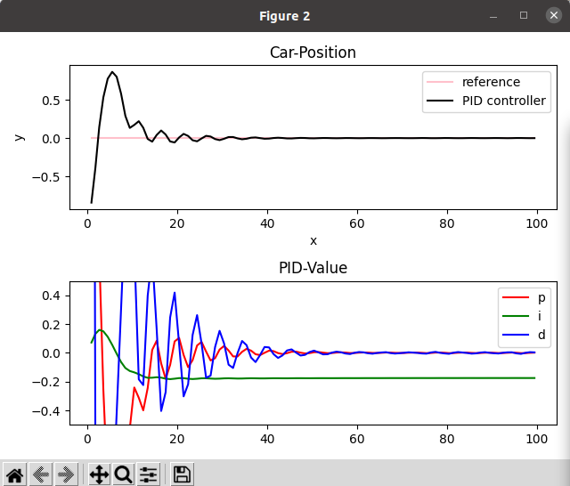

# README

Run the following code one by one to see the difference between using P, PD and PID controller.

## Prerequisite

You need to have the following library:

```
pip install numpy
```

## How to run

In the terminal, run the following command: 

```
python p_controller.py
python pd_controller.py
python pid_controller.py
python pid_twiddle.py
python pid_twiddle_pid.py
```

Note: close the following windows first before using CTRL+C to end the program.


